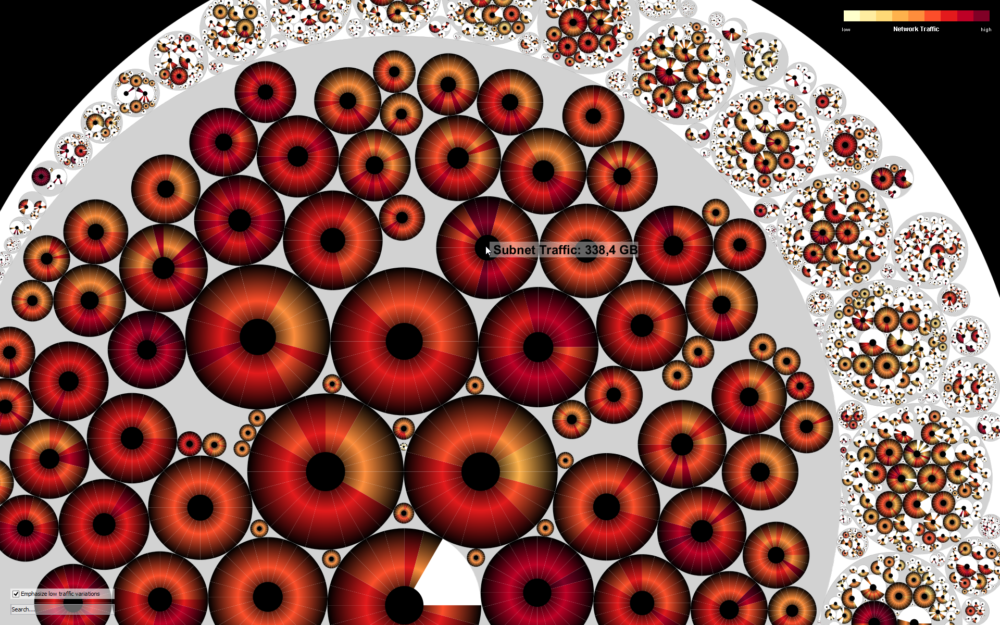

# ClockMap Demo

Treemaps are a powerful method to visualize especially time-invariant hierarchical data. Most attention is drawn to rectangular treemaps, because their space-filling layouts provide good scalability with respect to the amount of data that can be displayed. Since circular treemaps sacrifice the space-filling property and since higher level circles only approximately match the aggregated size of their descendants, they are rarely used in practice. However, for drawing circular glyphs (see picture on the right) their shape preserving property can outweigh these disadvantages and facilitate comparative tasks within and across hierarchy levels.

We introduced the interactive ClockMap visualization in 2012, which effectively supports the user in exploring and finding patterns in hierarchical time-series data through drill-down, semantic zoom and details-on-demand.

## Demonstration

This is a reimplementation of the ClockMap technique [1]. In contrast to the original implementation, this is a feature-reduced version only demonstrating the visualization technique itself (without the possibility to interactively modify/move/remove nodes on the screen).

## Examples

[1] F. Fischer, J. Fuchs and F. Mansmann. ClockMap: Enhancing Circular Treemaps with Temporal Glyphs for Time-Series Data. Proceedings of the Eurographics Conference on Visualization (EuroVis 2012 Short Papers), pages 97-101, DOI: 10.2312/PE/EuroVisShort/EuroVisShort2012/097-101, 2012.
